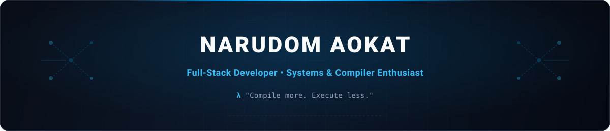

<div align="center">
  

  <a href="https://git.io/typing-svg">
    
  </a>

  <p>
    <samp>
      <b>narudom</b> (ASTOHACKER)<br>
      student @ psu hat yai · building tools for my own mind<br>
      full-stack · ssr · second brain · cli-first
    </samp>
  </p>

  <p>
    <a href="https://resume-web-one-sigma.vercel.app/">
      
    </a>
    <a href="mailto:disasdrop@gmail.com">
      
    </a>
    <a href="https://www.facebook.com/nameshut">
      
    </a>
    <a href="https://instagram.com/nar_udom">
      
    </a>
    
  </p>
</div>

---

### Overview

```text
┌── [about-me] ─────────────────────────────────────────────────────────────────────┐
│ • Studies:     B.Sc. in Information Technology (Year 2) @ PSU Hat Yai (GPA: 3.43) │
│ • Focus:       High-performance backends, compilers & system design               │
│ • Systems:     Second Brain / PKM (Obsidian & LLM-augmented workflows)            │
│ • Environment: Linux power-user (CachyOS / Arch Linux) & CLI-first craft          │
└───────────────────────────────────────────────────────────────────────────────────┘
```

---

### Featured Projects

| Project | Description | Stack |
| :--- | :--- | :--- |
| **[nelysia](https://github.com/ASTOHACKER/nelysia)** | Compiler-first TypeScript backend framework for Bun & Node.js. *Compile more. Execute less.* | `Bun` `TypeScript` `Compiler` |
| **Second Brain** | Personal knowledge graph, LLM-assisted search & obsidian external brain system. | `LLM` `Obsidian` `Markdown` |
| **[Resume-Web](https://resume-web-one-sigma.vercel.app/)** | Interactive portfolio & resume showcase. | `Next.js` `Tailwind CSS` `Vercel` |
| **[NARUCL](https://github.com/ASTOHACKER/NARUCL)** | High-productivity CLI utilities and developer tooling. | `TypeScript` `CLI` `Node.js` |
| **[naruos](https://github.com/ASTOHACKER/builld_os_naruos)** | Low-level OS kernel and system architecture explorations. | `C` `C++` `Assembly` `OS` |

---

### Tech Stack

<p align="center">
  <a href="https://skillicons.dev">
    
  </a>
</p>

<details>
<summary><b>Detailed Breakdown</b></summary>
<br />

- **Languages:**  
  
  
  
  
  
  
  

- **Frontend & Mobile:**  
  
  
  
  

- **Backend, Runtime & Database:**  
  
  
  
  
  

- **Tools & Environments:**  
  
  
  
  
  
  
  

</details>

---

### GitHub Activity

<p align="center">
  
  
</p>

---

<p align="center">
  <samp><i>"Compile more. Execute less."</i></samp>
</p>
